# Lane detection

Lane detection on roads using camera image-feed.


## Overview
This project is part of [Udacity's Self-Driving Car Nanodegree program](https://www.udacity.com/drive)
and much of the source comes from the program's lecture notes and quizzes.

Following steps were performed to achieve a lane-detection pipeline which can
look for lanes in a video.

1. Camera calibration : Finding camera's calibration matrix and distortion coefficients.
2. Distortion correction : Un-distorting source images.
2. Image filtering : Filtering an image containing a lane based on gradient and
color values of its pixels.
3. Image warping : Applying perspective transformation to get a
"birds-eye" view of the filtered-image.
4. Lane detection and update : Computing polynomial fits of the lane's
left and right lines.
5. Computing lane-curvature and vehicle offset from lane-center.
6. Image warping : Projecting back detected lane on top-down view of the image to
the original image.
7. Writing the output image to an output-video.

## Dependencies
1. Python-3.5
2. OpenCV-Python
3. Moviepy
4. Numpy
5. Matplotlib
6. Pickle

## Running the detection routine
1. Switch to the source directory `src`:
```bash
cd src
```
2. Run the lane-detection script. This will take the video (project_video.mp4)[project_video.mp4]
as its input, runs the detection pipeline on it and saves the output to
[detected_lane.mp4](detected_lane.mp4) in the parent directory.
```bash
python lane_detection.py
```


## Directory Layout
* src : Contains the following source files.

|File  | Description |
|:----:|:-----------:|
|line.py | Line class capturing the characteristics of a lane-line. |
|vision_util.py | Visualization and detection utility. |
|lane_detection.py | Contains lane-detection pipeline with other (sub)pipelines like camera-calibration and image-warping. |
| calibration.p | Pickled camera calibration matrix and distortion coefficients. |
| perspective_transform.p | Pickled perspective transform and its inverse transform matrices |

* camera_cal : Chessboard images for camera-calibration.
* test_images : Images of lanes which we used for testing the pipeline.
* output_images: Outputs from different parts of the pipeline which were applied
to images in *test_images*.
* detected_lane.mp4 : Output video containing the detected lane annotated with
lane-curvature and vehicle-offset from lane-center values.

## Detection pipeline description
Let's go through the detection routine steps mentioned above.

### Camera calibration and Distortion correction

In this step, the camera is calibrated in order to remove its distortion effects
(radial and tangential). Chessboard images in the folder camera_cal/ were used,
where the following steps are taken:

1. Converting chessboard images to grayscale and identifying corners.
2. Identified corners are used to map a set of image points to points in
real-world space, according to which the calibration matrix and distortion
coefficients are found.
3. Calibration matrix and the distortion coefficients are saved in a pickle file
(`src/calibration.p`) for reuse.

Above steps are performed in `src/lane_detection.py`, under
`calibration_pipeline()` function, where OpenCV's `findChessboardCorners` and
`calibrateCamera()` utilities are used.

| Sample (distorted) image | Undistorted version after calibration |
|:-----------------------------------:|:-------------------------------------:|
| | 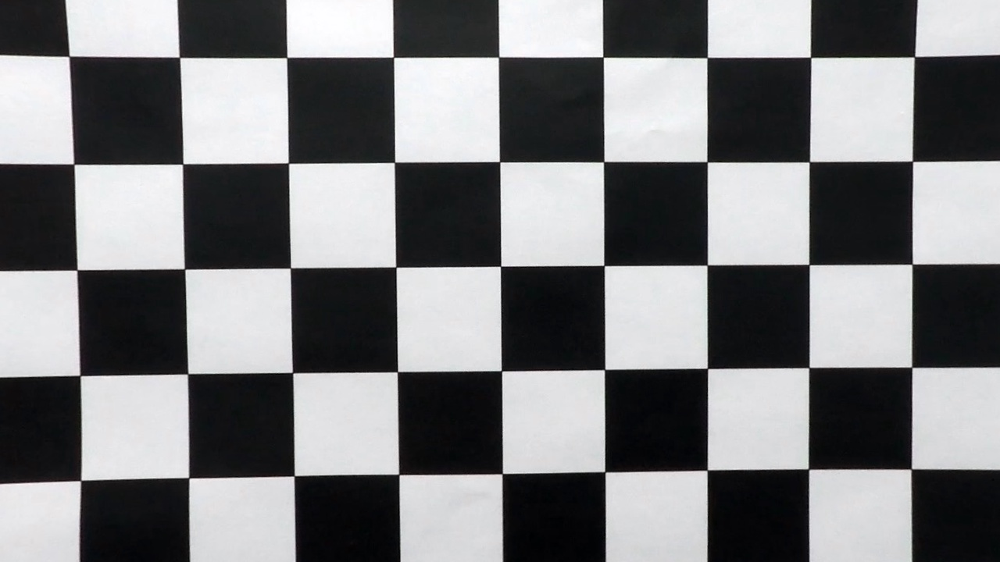|
| | 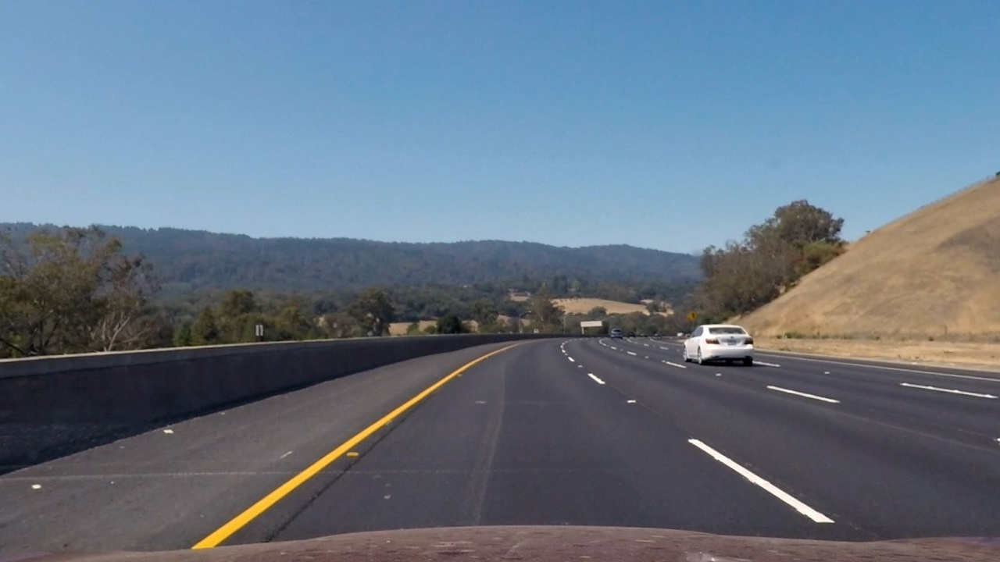|

### Image filtering

In order to identify the lane in an image, an input image (undistorted) is
filtered with respect to its pixel gradients and color values, and a
*binary-image* is returned. Following thresholds are applied.

1. Gradient threshold
  - Sobel filter on absolute value of pixels in x-axis is applied.
  - Sobel filter on both x and y-axis is applied and its gradients are
  thresholded with respect to the magnitude of scaled pixel values, scaled
  between 0 and 255.
  - Sobel filter along a given direction is applied on the gradients, targeted
   direction approximately sitting between _&pi;_/4 and _&pi;_/2.

2. Color threshold
  - Input image in RGB colorspace is converted to HLS (Hue, Light and Saturation)
  colorspace, where it is thresholded with respect to the Saturation channel
  (S-channel) values.

Above thresholding steps are carried out in `combined_threshold()` in
`src/vision_util.py`. Sample binary-images for images in test_images/ directory
obtained from this routine are saved in output_images/binary/ directory.

| Undistorted color image | Binary image after image-filtering |
|:-----------------------------------:|:-------------------------------------:|
| | 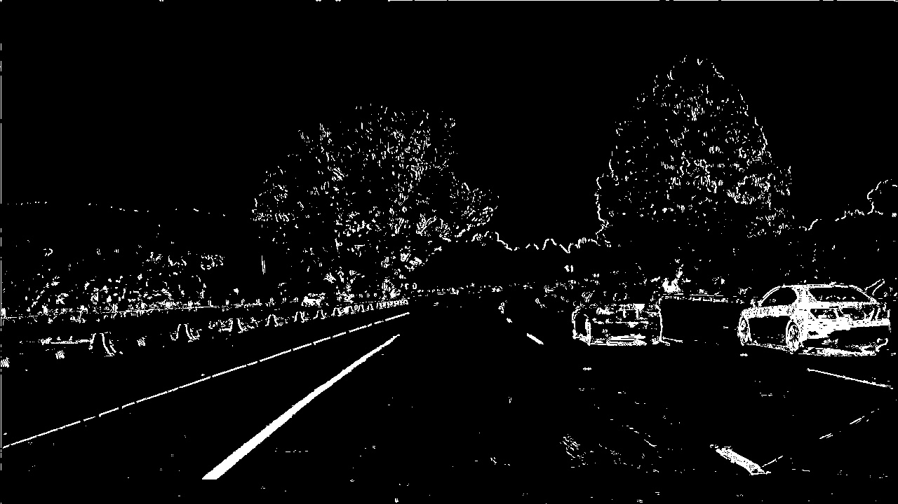|
| | 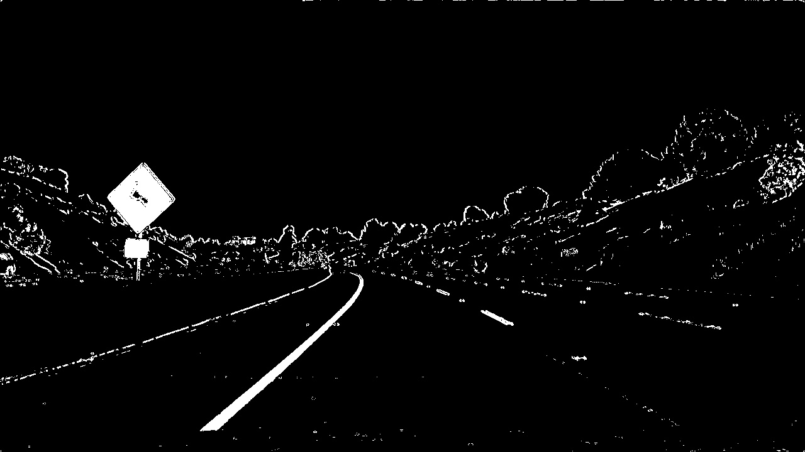|
| | 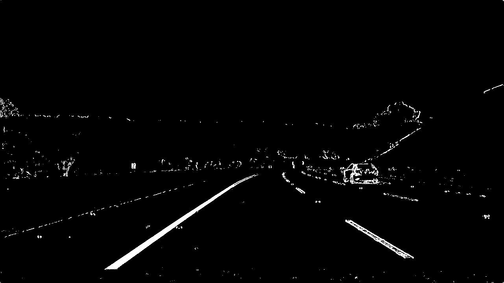|
| | 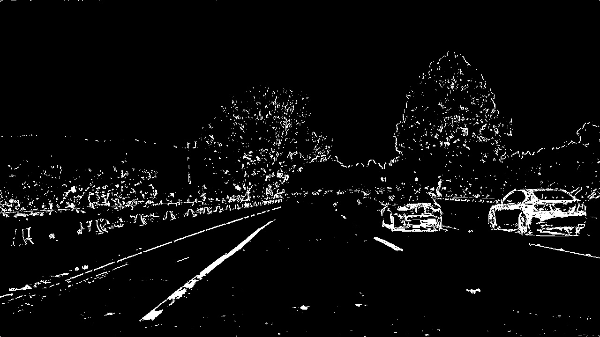|
| | 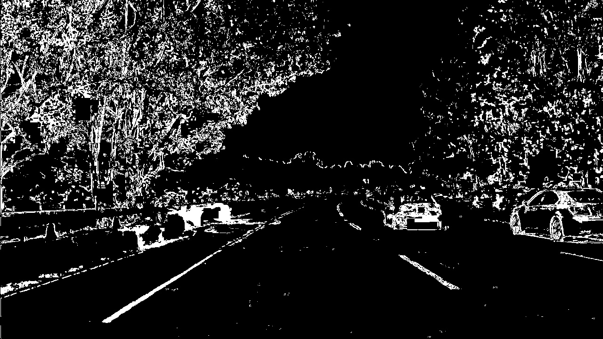|


### Image warping for bird's eye view

Binary image obtained from the above routine is warped to get a *bird's eye*
view on the lane, with which we can identify lane-lines and fit polynomials.
Perspective transformation is applied on the input image using OpenCV's
`getPerspectiveTransform(..)`. Steps that this routine captures:

1. A (hardcoded) region of interest (ROI), in form of a 4-sided polygon, in the
source binary image is selected.
2. ROI's four vertices are projected to rectangular coordinates with a random
offset (set to 100 pixels) in x-values of the pixels. This projection/mapping
gives us the perspective transformation matrix.
3. This transformation matrix is saved in a pickle file (`src/perspective_transform.p`)
for reuse.

Above steps are available in `vision_util.py` under `find_perspective_transform()`
function. Future use of the matrix involves calling OpenCV's `warpPerspective(..)`
function to warp the image. Sample warped binary images having bird's eye view
of the lane are stored in `output_images/binary_warped`.

| Filtered binary image | Warped binary image having bird's eye view |
|:-----------------------------------:|:-------------------------------------:|
| | 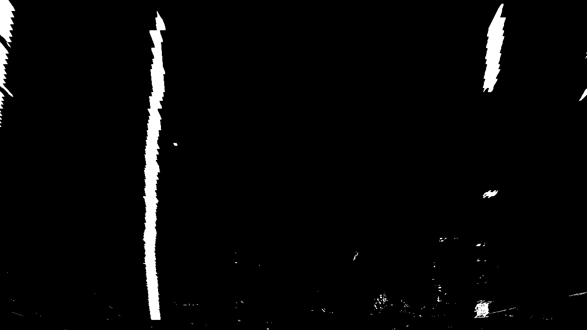|
| | 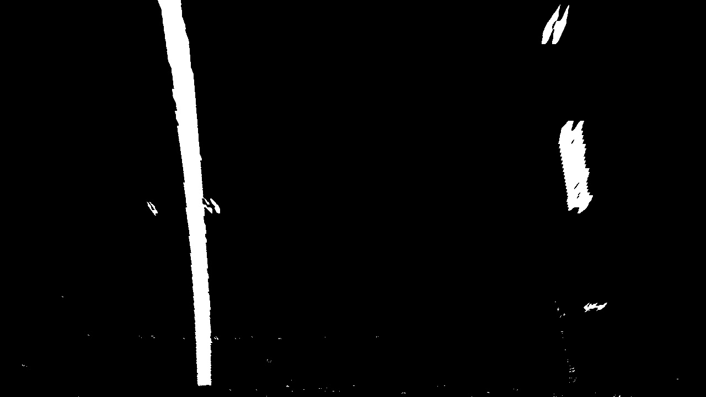|
| | |
| | 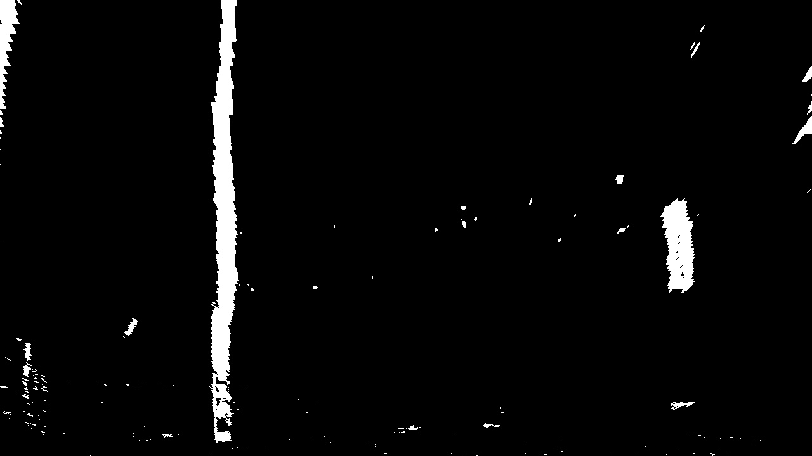|
| | 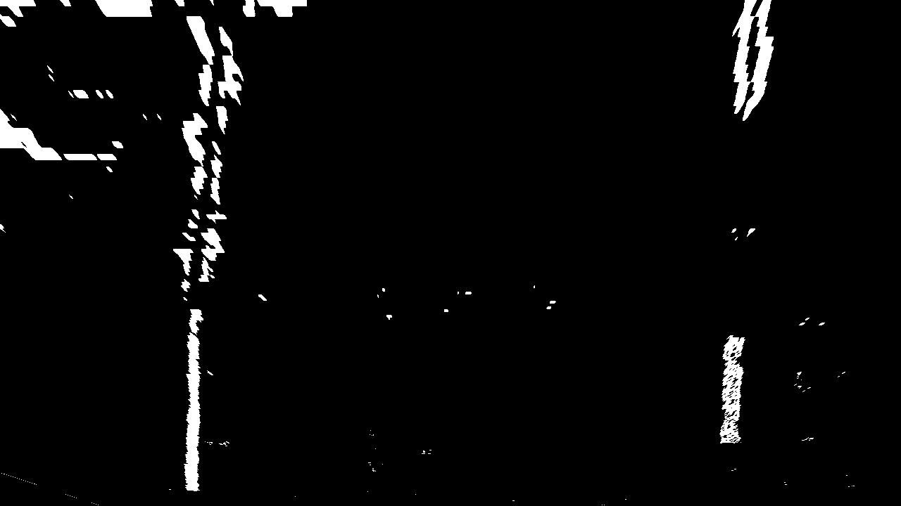|


### Lane detection and update

Once we have the warped binary image, we look for lane-lines doing the following:

1. Histogram of pixel intensities is found to find the starting x-indices of
left and right lane-lanes at the bottom part of the image.
2. By iterating through the image bottom-up through multiple windows, and by
making use of the starting indices obtained from the above step, left and
right lane-lines' pixel indices are found in the +/- 100 pixel-margin around the
previous windows' detections. Windows' centres belonging to left and right lane-
lines are adjusted in each iteration to represent the mean of their respective
detected-pixels' indices.
3. After collecting the lines' pixel indices, a second-order polynomial fit is
performed which gives us the equation of the lane-lines.

Above steps are performed in `src/vision_util`, `detect_lane_lines()` function.

Subsequent detections make use of the polynomial equations found above:

1. To do a targeted search in the region around the lane-lines' curve where
there's a high chance of finding/extending the lane-lines. This is carried out via
a *lane-line-update* routine, as present in `update_detected_lane()` function
in `src/vision_util.py`.
2. In addition to doing a targeted search, lane-lines' are smoothened by
performing a moving-average on their polynomial coefficients. This is done in
`src/line.py`'s `update_fit()` function, which makes use of eight image-frames
(utmost) to cache and average the coefficients.

| Sample warped binary image | Polynomial fit on lane-lines |
|:-----------------------------------:|:-------------------------------------:|
| | 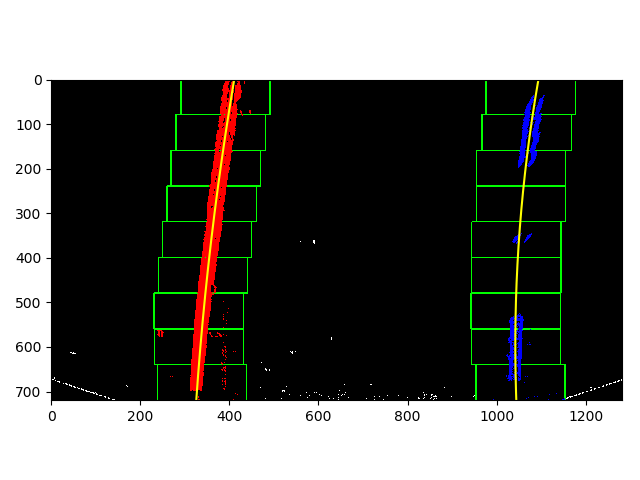|


### Lane curvature and vehicle-offset

Polynomial fits on lane-lines are made use of to compute the lane's radius
curvature and the vehicle's offset's from the lane-center. We make use of (known)
scaling factor which maps image resolution to metres in the world-space i.e.
3.6 metres per pixel in x-dimension and 30 metres per pixel in y-dimension.

1. `calculate_curvature()` in `src/vision_util.py` computes the curvature of the lane
as per the second-order differential equation mentioned
[here](https://www.intmath.com/applications-differentiation/8-radius-curvature.php).

2. `calculate_vehicle_offset()` in the same file computes the offset from finding
the difference between the lane-line's center and the image's center.

### Annotated source image with detected lanes

Once we find the lane-lines, we project back the lane-annotated version of the
image back to the original image as shown below. This is done via doing an
inverse perspective transform that we did earlier while warping for bird's-eye
view of the image.

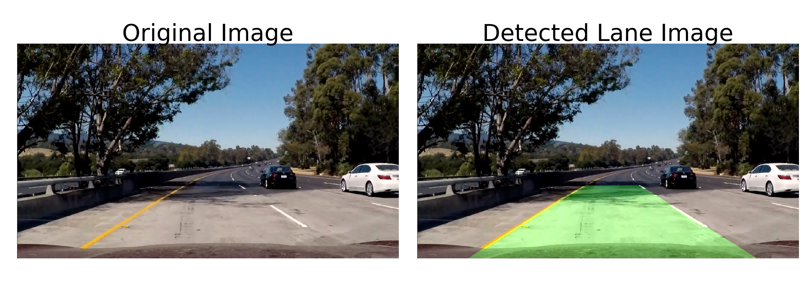

Further we annotate the original image with the curvature and vehicle-offset
details. All these steps are carried out in `draw_lane()` function under
`src/vision_util.py`.

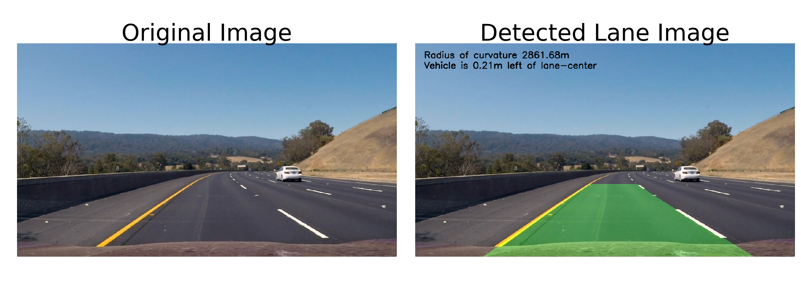

Finally, the above pipeline steps, except for camera-calibration are put together
in `lane_detection_pipeline()` function in `src/lane_detection.py`. This function
is run against an input stream of video [project_video.mp4](project_video.mp4),
and the output is saved in [detected_lane.mp4](detected_lane.mp4).

## Further improvements

1. There are various scenarios where this lane-detection pipeline would fail
for example in cases where there's occlusion (from other vehicles), where there are
continuous streak of shadows with lower visibility, etc. This drawback was observed
in the challenge-videos of the project.

2. Detection routine above is reliant on ROI to begin with. It'd make the pipeline
more robust if we look for pixel features representing lane-lines rather than
looking for lane-line pixels in an ROI. Making use of convolutional neural nets
as outlined in [works like this](https://link.springer.com/chapter/10.1007/978-3-319-12637-1_57)
would improve the robustness of the detection-pipeline.
